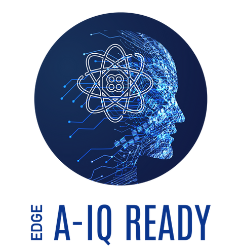
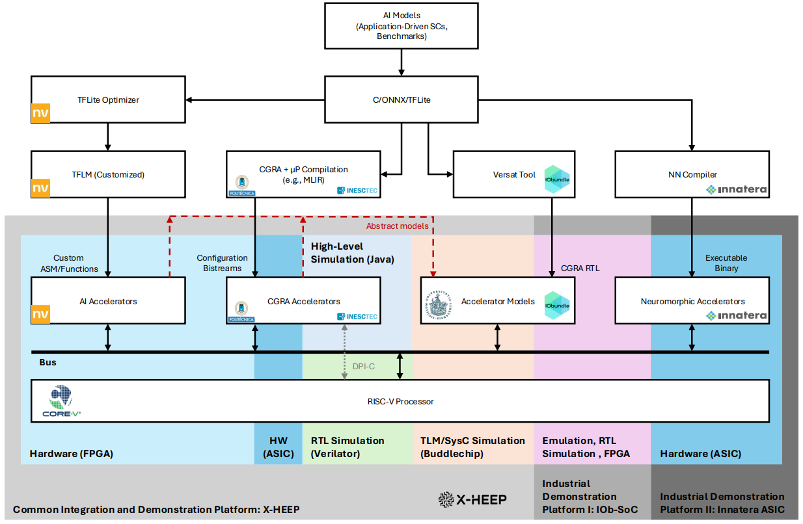

  

# A-IQ READY Platform

The A-IQ Ready project aims to introduce and materialise an intelligent autonomous ECS fit for our digital age and utilise crucial technologies, like edge continuum orchestration for artificial intelligence and quantum sensing.

This organization represents the efforts to provide a common platform within the project for edge AI. It contains several repositories, from the various project partners, with their contribuitons to the platform.

  

# Repositories index

- [Elastic CGRA Generator](https://github.com/aiqready-platform/cgra_gen): Architectural template to generate and simulate elastic Coarse-Grained Reconfigurable Architectures (CGRAs)
- [RISC-V ISA extensions for AI](https://github.com/aiqready-platform/riscv-ai-extensions): Collection of Dockerfiles for platforms that support AI-related ISA extensions for the RISC-V processor
- [A-IQ Ready Source-to-Source](https://github.com/aiqready-platform/aiqready-s2s-compilation) (*private*): Examples of the source-to-source portion of the toolflow, with C/C++ code transformmations 
